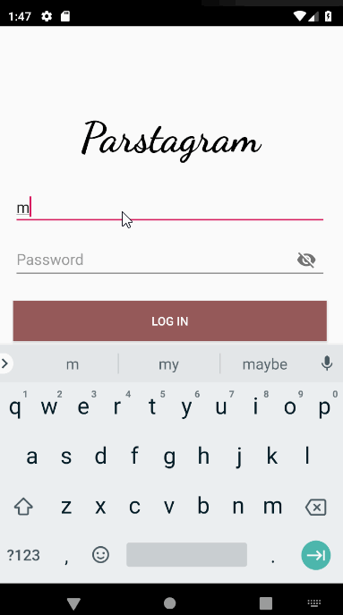

# *Parstagram*

**Parstagram** is an Android photo sharing app similar to Instagram but uses Parse as its backend.

## Features

- User can view the last 20 posts submitted to "Instagram".
- User can pull to refresh the last 20 posts submitted to "Instagram".
- User can switch between different tabs - viewing all posts (feed view), capture (camera and photo gallery view) and profile tabs (posts made) using fragments and a Bottom Navigation View. 
- User can sign up to create a new account using Parse authentication.
- User can log in and log out of his or her account.
- The current signed in user is persisted across app restarts.
- User can take a photo, add a caption, and post it to "Instagram".

## App Walkthrough

Here's a walkthrough of implemented features:

 

GIF created with [LiceCap](http://www.cockos.com/licecap/).

## Open-source libraries used

- [Android Async HTTP](https://github.com/codepath/CPAsyncHttpClient) - Simple asynchronous HTTP requests with JSON parsing
- [Glide](https://github.com/bumptech/glide) - Image loading and caching library for Android
